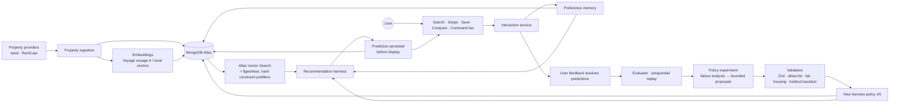

# HomeSwipe

**HomeSwipe does not only learn what homes a person likes. It learns how the recommendation system itself should learn that person.**

HomeSwipe is an AI-native real-estate discovery app for New York City: swipe, search, map, save, compare, and a Home DNA profile of your taste. Underneath is a **recursive recommendation harness**. Before you see each home, it predicts whether you'll like it and persists that prediction. It then grades itself on what you actually do, diagnoses its failures, proposes bounded changes to its own policy, backtests them on held-out history, and promotes a new policy version only when the evidence says it's better. Everything lives in MongoDB Atlas.

> Built for **The Harness Engineering & Model Wrangling Hackathon** (MongoDB).
> **Primary track: Recursive Harnessing.** The harness evolves its own ranking weights, memory policy, context policy, exploration strategy, retrieval generators, feature importance and prediction threshold through a constrained, versioned, auditable policy system. It never rewrites code.
> **Secondary: Long Horizon Engineering.** Preference memory persists across sessions, with explicit recent-vs-long-term treatment decided by the harness.

<!-- Screenshots: add images to docs/screenshots/ -->
| Discover | Swipe | Home DNA | Harness lab |
| --- | --- | --- | --- |
| _docs/screenshots/discover.png_ | _docs/screenshots/swipe.png_ | _docs/screenshots/home-dna.png_ | _docs/screenshots/lab.png_ |

## The loop

```
interaction → prediction (persisted first) → hard metric → persistent memory
→ failure analysis → policy experiment → validation → harness evolution → better recommendations
```

1. **Predict before showing.** Every feed card creates a `property_impressions` document with `predictedLikeScore`, `predictedLabel`, `policyVersion` and a full score breakdown, *before* the user sees it.
2. **Measure.** A like, super-like, save or dislike resolves the impression into `recommendation_predictions` (predicted vs. actual). Accuracy per policy version, top-3 like rate, AUC and calibration come straight from these documents.
3. **Remember.** Every few meaningful interactions, a batched update rebuilds learned preferences (a regularized logistic regression over 36 physical and amenity dimensions, long-term and recent). It writes typed memories (explicit, inferred, recent, uncertain, behavioral, experiment learnings) and re-embeds the preference summary only when it meaningfully changes.
4. **Evolve.** On demand, and automatically every 10 new real outcomes, the harness:
   1. Replays history *prequentially* under the current policy, using only what was known at each prediction.
   2. Computes failure findings from the numbers. Examples: over-weighted metadata, ignored negative preferences, a recent preference shift, a miscalibrated threshold, too little exploration.
   3. Generates bounded candidate policies. Each change carries `{change, evidence, expectedEffect}`.
   4. Picks the best candidate on training data.
   5. Compares candidate and current policy on the newest held-out interactions.
5. **Promote or reject.** Promotion requires all of the following:
   - ≥30 resolved predictions and ≥10 holdout examples
   - a +3-point holdout accuracy gain
   - more paired wins than losses
   - no balanced-accuracy or top-N regression

   Policies are immutable versions. Rejected candidates are kept, and every experiment and reason is stored.

Honesty is built in:
- Raw scores are not called probabilities until a Platt calibration on ≥30 outcomes exists.
- Simulated users from the lab are tagged `simulated: true` and never mixed into the default **Real** metrics.
- `/lab` compares versions on the **same data**, because live per-version accuracy is confounded by which homes each version happened to show.

## Architecture



More detail: [`docs/architecture.md`](docs/architecture.md).

## MongoDB Atlas usage

MongoDB is the system of record and the learning substrate. It has 15 collections, all used: `users`, `properties`, `interactions`, `property_impressions`, `saved_properties`, `collections`, `preference_memories`, `preference_dimensions`, `recommendation_sessions`, `recommendation_predictions`, `harness_policies`, `harness_experiments`, `evaluation_runs`, `saved_searches`, `conversations`.

- **Atlas Vector Search**, with two indexes on `properties`:
  - `property_embedding_index`: 1024-d Voyage `voyage-4` (or `voyage-4-lite`, or OpenAI `text-embedding-3-small@1024`) embeddings, filtered by `ai.embeddingModel`.
  - `property_feature_index`: 36-d deterministic feature vectors, so vector retrieval works even with no API keys.

  Budget, bedrooms, bathrooms, property types and geography are `$vectorSearch` **prefilters**. Personalization can't escape them.
- **Geospatial:** a 2dsphere index on `address.location` and a `$geoNear` candidate generator the harness can enable.
- **Integrity:** a partial unique index guarantees exactly one active policy per user. A unique `impressionId` on predictions prevents double resolution. A lease lock on the user document serializes evolution runs.
- **Index lifecycle:** `pnpm setup:indexes` creates the vector indexes and polls `listSearchIndexes()` until they are queryable. The app checks readiness before issuing `$vectorSearch` and records which retrieval path ran.

Exact index definitions: [`docs/mongodb.md`](docs/mongodb.md).

## Setup

Requirements: Node 22+, pnpm, and a MongoDB Atlas cluster (the hackathon sandbox works).

```bash
pnpm install
cp .env.example .env.local        # set MONGODB_URI (required); other keys optional
pnpm setup                        # seed listings (+ embeddings if configured) → indexes (waits for Vector Search) → demo user
pnpm dev                          # http://localhost:3000
```

### Environment variables

| Variable | Required | Purpose |
| --- | --- | --- |
| `MONGODB_URI` | yes | Atlas connection string |
| `MONGODB_DB_NAME` | no | Database name (default `homeswipe`) |
| `VOYAGE_API_KEY`, `VOYAGE_MODEL` | no | Voyage embeddings (`voyage-4` default, `voyage-4-lite` for cost/latency) |
| `OPENAI_API_KEY` / `OPENROUTER_API_KEY`, `LLM_MODEL` | no | Structured parsing, narration and optional policy proposals. Heuristics otherwise. OpenAI also serves as the embedding fallback. |
| `NEXT_PUBLIC_MAPBOX_TOKEN` | no | Interactive map. Without it, a simplified SVG map. |
| `PROPERTY_PROVIDER`, `RENTCAST_API_KEY` | no | `seed` (default) or `rentcast` |
| `DEMO_MODE` | no | Enables `/lab` simulation and reset outside development |
| `HARNESS_AUTO_EVOLVE` | no | Automatic evolution on real data (default `true`) |

Thresholds (`HARNESS_MIN_RESOLVED`, `HARNESS_MIN_HOLDOUT`, `HARNESS_MIN_ACCURACY_DELTA`, `HARNESS_AUTO_EVOLVE_EVERY`, `PREFERENCE_UPDATE_EVERY`) are documented in `.env.example`.

### Seed data

`data/seed-properties.json` holds 150 synthetic NYC listings across all five boroughs, generated deterministically by `lib/seed/generate.ts` (`pnpm seed:generate` regenerates it).
- The listings are built from eight archetypes: glass tower, pre-war, brownstone, loft, renovated walk-up, dated value, minimalist boutique and suburban house. Noise and deliberate counter-examples make the learner work for its signal.
- They vary on light, floors, kitchens, outdoor space, building height, transit, finishes and style.
- Photos are curated from Unsplash (Unsplash License). Each URL was verified and style-matched to the listing's attributes, with a generated fallback if an image fails.
- Listings are labelled as sample data in the UI.

### Commands

| Command | What it does |
| --- | --- |
| `pnpm dev` / `pnpm build` / `pnpm start` | Run / build the app |
| `pnpm test` | Vitest: engine unit tests + an offline end-to-end harness test |
| `pnpm typecheck` / `pnpm lint` | Type and lint checks |
| `pnpm setup` | `seed` + `setup:indexes` + `setup:demo` |
| `pnpm verify:atlas` | Connection, collection counts, indexes and a live `$vectorSearch` (fails unless retrieval runs on Atlas Vector Search) |
| `pnpm simulate [profile] [count] [--evolve]` | Simulated interactions through the real pipeline |
| `pnpm reset:demo [--full]` | Clear the demo user's learned state and restore v1 |

## Product tour

- **Discover:** a personalized grid with match %, concise reasons, save, hide, similar and compare.
- **Swipe:** a mobile-first deck with pointer drag, accessible buttons and keyboard arrows. Predictions are visible only in judge mode.
- **Search:** filters plus natural language ("bright modern condo near transit with a big kitchen"). Parsed hard constraints show as removable chips, and explicit filter controls always win.
- **Map:** Mapbox when a token exists, otherwise an SVG fallback, with a list and preview.
- **Property:** gallery, costs, taxes/HOA, estimated monthly, why-it-matches and tradeoffs, similar homes, collections, compare, and "tell us why".
- **Saved & collections:** Favorites, Dream Homes (a stronger style signal), Tour, and custom collections.
- **Compare:** 2–4 homes side by side, plus "compared on what you care about".
- **Home DNA:** loves and avoids with strength, confidence and source, plus what HomeSwipe is still learning. One-tap corrections are stored as high-confidence explicit evidence.
- **Command bar (⌘K):** a natural-language control layer, not a chatbot. Examples: "Find something like this but cheaper", "Keep this style but closer to Manhattan", "I don't dislike this because of the kitchen, I dislike the carpet".
- **Profile:** hard criteria (never touched by the harness), saved searches and alert settings, judge mode.
- **`/lab`** (judge view): a Real | Simulated | Combined selector, accuracy with n and CI, top-3 like rate, AUC, calibration, policy history with diffs and evidence, evaluation runs with promotion checks, recent predictions, and controls to run evolution, simulate and reset.

Demo scripts (3 minutes and 60 seconds): [`docs/hackathon-demo.md`](docs/hackathon-demo.md).

## Deploying to Vercel

Set these in the Vercel project (Production):

| Variable | Value |
| --- | --- |
| `MONGODB_URI` | Atlas connection string (required) |
| `MONGODB_DB_NAME` | `homeswipe` |
| `DEMO_MODE` | `true` only while demoing: it exposes `/lab` simulate and reset on the public URL |
| `HARNESS_AUTO_EVOLVE` | `true` |
| `NEXT_PUBLIC_APP_URL` | the deployment URL |
| Optional | `VOYAGE_API_KEY`, `OPENAI_API_KEY` / `OPENROUTER_API_KEY`, `NEXT_PUBLIC_MAPBOX_TOKEN` |

Vercel Functions use dynamic egress IPs. In **Atlas → Network Access**, allow `0.0.0.0/0` (typical for a hackathon sandbox) or connect the cluster through the Atlas–Vercel integration. Run `pnpm setup` against the production database once before the first deploy.

## Fallbacks

The core loop stays demonstrable with only a MongoDB URI:
- Seed provider in place of RentCast.
- Local feature vectors (still searched with Atlas Vector Search) in place of Voyage.
- Deterministic parsers and heuristic proposals in place of an LLM.
- An SVG map in place of Mapbox.

## Fair housing & safety

- **No protected traits.** HomeSwipe never infers, stores or optimizes on race, color, religion, sex, disability, familial status or national origin. The same goes for NYC-protected age, marital status, gender identity and sexual orientation, and for proxies such as "family-friendly", places of worship, schools as a family proxy, or neighborhood demographics.
- **Central guardrail.** `lib/guardrails/fair-housing.ts` enforces this on every write path: dimensions, memories, policy feature importance, parser and LLM output, and summaries.
- **What personalization uses.** User-chosen geography, price, property type, and physical or amenity attributes only.
- **Hard constraints stay fixed.** They are not part of the tunable policy, so learned behavior can never raise a budget.

## Project structure

```
app/            routes (landing, onboarding, (app)/…, api/…)
components/     UI by feature (property, swipe, search, maps, preference, lab, command, compare, …)
lib/engine/     pure recommendation + harness math (scoring, preference state, replay, evolution, promotion…)
lib/            env, MongoDB client/indexes, embeddings, LLM, providers, guardrails, features, seed
services/       domain services over MongoDB (feed, interactions, preferences, harness, search, …)
models/         Zod schemas and document types
scripts/        seed, indexes, demo user, simulate, reset
tests/          Vitest suites
docs/           architecture, MongoDB, demo
```

## Roadmap

- **MLS/RESO integration:** a `PropertyProvider` implementation behind the same normalized model, with scheduled ingestion and re-embedding.
- **Collaborative search:** couples and roommates would score homes under each member's preference state, blending fits and flagging disagreements. Data is already keyed by `userId`, and identity lives behind `getCurrentUserId()`, ready for Clerk or Auth.js.
- **Alerts delivery:** saved searches already compute new and high-match listings. Next is email/push via a scheduled job.
- **Commute analysis and tour planning:** commute time as a user-chosen constraint; tour routes from the Tour collection.
- **Realtor integrations, mortgage affordability and market trends.**
- **Harness:** multi-armed exploration over generator mixes, and contextual calibration per surface.
