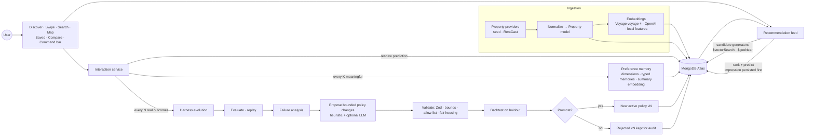

# HomeSwipe architecture

HomeSwipe is a consumer real-estate app wrapped around a **self-improving recommendation
harness**. The product surfaces (discover, swipe, search, map, saved, compare, Home DNA) produce
interaction data. The harness predicts, measures, diagnoses and rewrites its own policy.

## Layers

| Layer | Location | Notes |
| --- | --- | --- |
| Pure engine | `lib/engine/*` | No DB or framework imports and fully unit-tested. The **same code** scores the live feed and replays history under candidate policies, so backtests are real rather than approximations. |
| Domain services | `services/*` | Thin MongoDB orchestration around the engine: feed, interactions, preferences/memory, harness, search, compare, command, simulation, demo reset. |
| API | `app/api/*` | Zod-validated route handlers with consistent error mapping (`lib/http/route.ts`). Background learning runs via `after()`. |
| UI | `app/*`, `components/*` | Server components read services directly; interactive pieces are client components calling the API. Feeds load client-side so impressions (and predictions) exist only when a person actually sees them. |

## The engine

- **Feature space** (`lib/features/dimensions.ts`): 36 physical and amenity dimensions such as natural light, hardwood, open kitchen, balcony, high-rise and near transit. Each listing has a value in [0, 1] for every dimension.
- **Preference state** (`preference-state.ts`): a weighted, L2-regularized logistic regression over catalog-centered features, fit on all history ("long-term") and on the policy's recent window ("recent"). Inferred strength = tanh(β / 3). Confidence comes from Fisher information. Onboarding answers blend in. Explicit corrections override inferred evidence at 0.95 confidence. "Not because of the kitchen" attribution zeroes those features in the corrected reaction's sample.
- **Scoring** (`scoring.ts`): eight interpretable components (semantic, explicit, inferred, visual, behavior, metadata, freshness, exploration), each in [0, 1]. `fit` is the weighted mean of the six predictive ones; `total` adds freshness and exploration for ranking. Reasons and tradeoffs come from per-dimension contributions.
- **Prediction** (`prediction.ts`): `predictedLikeScore = σ(sharpness · (fit − threshold))`. It is a **score, not a probability**. Once a policy version has ≥30 resolved outcomes, `calibration.ts` fits Platt scaling on that version's history and a `calibratedLikeProbability` is stored alongside. Only calibrated values are ever called probabilities.
- **Exploration** (`exploration.ts`): low-confidence, high-variance dimensions become probe targets. Otherwise-relevant homes that sit at the extremes of a target (alternating high and low) are slotted in at `explorationPolicy.rate`. Each probe is recorded in `harness_experiments` with confidence before and after.
- **Replay** (`replay.ts`): prequential. Each labeled example is scored using only history that existed before it was shown, with the live system's batched-memory lag emulated. Regression fits are cached across candidates.
- **Evolution** (`evolution.ts`), in order:
  1. Chronological split: the holdout is the newest `max(10, 30%)` examples.
  2. Replay the current policy on training.
  3. Failure analysis, where every number comes from replay.
  4. Candidate generation: single fixes, pairwise combinations, a correlation-based reweight, and optional LLM proposals expressed only as allow-listed changes.
  5. Each candidate gets its like-threshold refit on recent training data, within a ±0.06 trust region.
  6. Selection by training AUC.
  7. One local-search step.
  8. Retrieval and exploration changes justified by evidence are attached and flagged `backtestable: false`.
  9. Current and candidate are compared on the untouched holdout.
- **Promotion gate** (`promotion.ts`): ≥30 resolved, ≥10 holdout, holdout accuracy +3 pts, candidate-only-correct > current-only-correct on paired examples, balanced accuracy regression ≤2 pts, top-N like rate regression ≤10 pts. Every result carries n and Wilson 95% intervals.

## Policy

`lib/engine/policy-schema.ts` is plain JSON validated by Zod:

- `candidateGenerators`: semantic, similarLiked, savedAnchor, exploration, fresh, geo
- `rankingWeights`
- `memoryPolicy`: recent window, recent/long-term/negative weights, how many memories feed the summary
- `explorationPolicy`
- `contextPolicy`: which memories go into the preference summary that gets embedded for retrieval
- `featureImportance`
- `prediction`

Changes are `(path, op, value, evidence, expectedEffect)` against an allow-list of paths
(`policy-patch.ts`). There is no path to hard constraints and no way to express code. Policies
are immutable: a promotion inserts version N+1 as `active` and flips N to `retired`. A partial
unique index guarantees one active policy per user.

The seeded **v1 is intentionally imperfect**:
- 55% of fit weight sits on listing metadata and onboarding answers.
- Learned signals are under-weighted.
- Negative memory is soft (0.8).
- Recency is barely distinguished.
- Exploration is 5% random, and similar-to-liked / saved-anchor retrieval are off.

## Memory: long horizon

- `interactions` is the permanent, timestamped source of truth. Nothing is summarized away.
- Preference state is rebuilt from full history. The policy decides how recent and long-term evidence are weighted, so a user returning weeks later keeps their profile, and recency can be emphasized or not as the harness learns.
- Batched updates (every 4 meaningful interactions, `PREFERENCE_UPDATE_EVERY`) persist `preference_dimensions` and typed `preference_memories`. Stale memories are **archived**, not deleted.
- The preference summary is rebuilt from memories selected by `memoryPolicy` and `contextPolicy`, and it is re-embedded only when its signature changes. So changing memory policy changes retrieval.
- `recommendation_sessions` split activity into sessions (30 min idle). Discover greets returning users.

## Real vs. simulated data

The `/lab` simulator drives the **real** pipeline with hidden-preference synthetic users: real
feed, impressions, predictions, recording and batched updates. Every document it creates is tagged
`simulated: true`.

- Metrics default to **Real** and offer a **Real | Simulated | Combined** selector.
- Auto-evolution uses real data only.
- Evaluation runs and policies record the data scope they were judged on.
- Calibration is fit per scope and never mixed.

## Fallbacks

| Missing | Behavior |
| --- | --- |
| RentCast | Seed provider (150 deterministic NYC listings) |
| Voyage / OpenAI | Local feature vectors; Atlas Vector Search still runs on `property_feature_index` |
| Vector index not queryable | In-process cosine over the constraint-filtered catalog (`retrievalMode` recorded) |
| LLM | Deterministic parsers, template memories and summaries, heuristic proposals, deterministic narration |
| Mapbox | SVG-projected NYC map with the same interactions |
| MongoDB | Setup screen and 503s with instructions; the landing page still renders |

## Fair housing

`lib/guardrails/fair-housing.ts` blocks protected-class traits and common proxies (familial
status, religion and places of worship, ethnicity, national origin, sex, disability, age, marital
status, and demographic or "safety" language) at every write path:
- dimension and memory writes
- policy `featureImportance`
- LLM and heuristic parser output
- summaries and narration

Personalization uses only user-chosen geography, price, property type and physical or amenity
attributes. The dataset contains no demographic data.

## Identity

`lib/auth/session.ts#getCurrentUserId()` returns the demo user. Adding Clerk or Auth.js means
returning the authenticated id there. All data is already keyed by `userId`, which is also the
path to shared or couple profiles: a shared profile would score each home under both users'
states and blend the fits.
